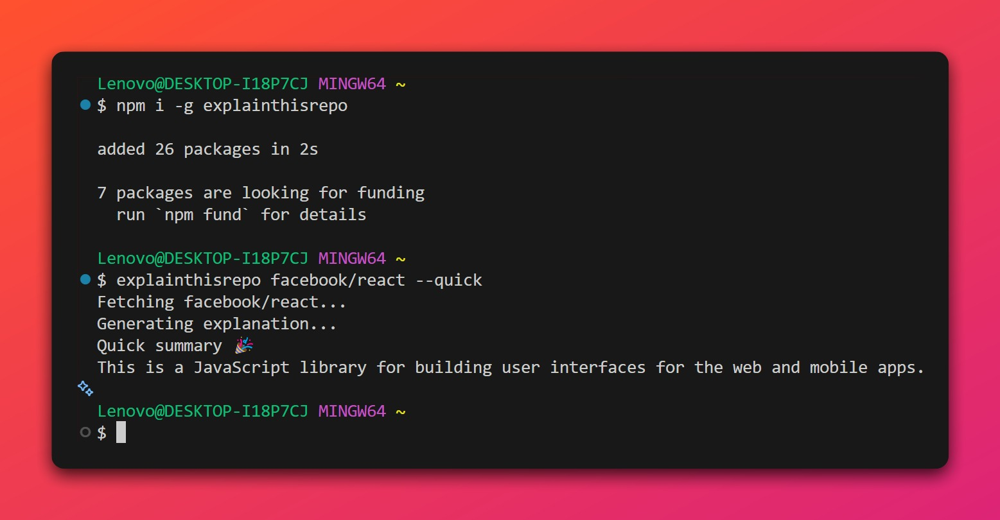
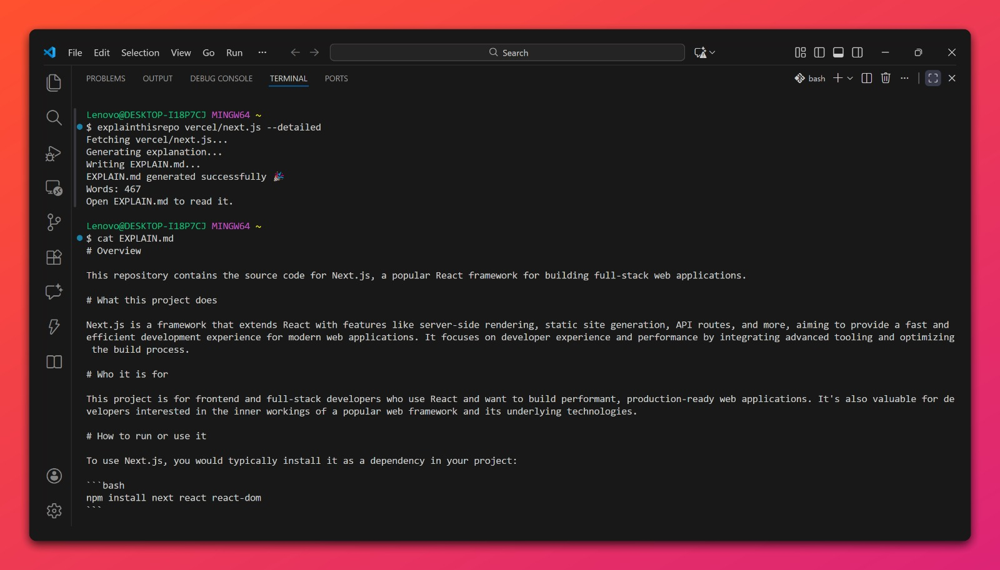
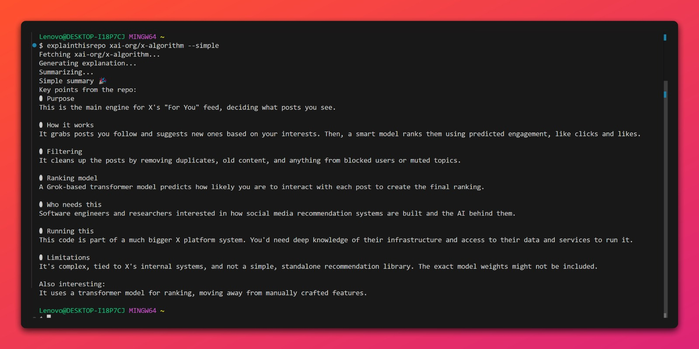
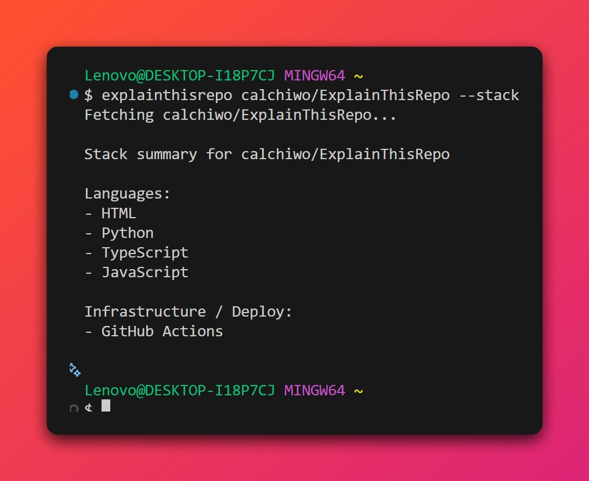

# ExplainThisRepo

ExplainThisRepo is a CLI that generates plain-English explanations of any codebase (GitHub repositories and local directories) by analyzing project structure, READMEs, and high signal files.

ExplainThisRepo is a command-line tool that analyzes GitHub repositories and local directories to generate plain-English explanations of the codebase architecture.

It helps developers quickly understand unfamiliar codebases by deriving architectural explanations from real project structure and code signals, producing a clear, structured `EXPLAIN.md`.

[](https://pypi.org/project/explainthisrepo/)
[](https://pepy.tech/projects/explainthisrepo)
[](https://pypi.org/project/explainthisrepo/)
[](LICENSE)
[](https://www.npmjs.com/package/explainthisrepo)
[](https://www.npmjs.com/package/explainthisrepo)
[](https://explainthisrepo.com)

---


---

## Key Features

- Generates architectural summaries from repository structure and code signals
- Fetches public repositories by GitHub URLs (with or without https), `owner/repo` format, issue links, query strings, and SSH clone links
- Analyzes repository data including file tree, configs, entrypoints, and high signal source files
- Extracts repo signals from key files (package.json, pyproject.toml, config files, entrypoints)
- Builds a file tree summary to understand project architecture
- Detects programming languages with the GitHub API
- Analyzes local project directories using the same pipeline as GitHub repositories
- Generates a structured plain-English explanation grounded in actual project files
- Outputs the explanation to an `EXPLAIN.md` file in your current directory or prints it directly in the terminal
- Multi-mode command-line interface

---

## Modes

- (no flag) → Full repository explanation written to EXPLAIN.md

- `--quick` → One-sentence summary

- `--simple` → Short, simplified explanation

- `--detailed` → Deeper explanation including structure and architecture

- `--stack` → Tech stack breakdown from repo signals

- `--version` → Check installed CLI version

- `--help` → Show usage guide

- `--doctor` → Check system health and active model diagnostics

---

## Configuration

ExplainThisRepo supports multiple LLM models:

- Gemini
- OpenAI
- Ollama (local or cloud-routed)

### Quick setup (recommended)

Use the built-in `init` command to configure your preferred model:

```bash
explainthisrepo init
# or npx explainthisrepo init
```
> For details about how initialization works, see [INIT.md](INIT.md).

## Installation

### Option 1: install with pip (recommended):

Requirements: Python 3.9+

```bash
pip install explainthisrepo
explainthisrepo owner/repo
```

Alternatively,

```bash
pipx install explainthisrepo
explainthisrepo owner/repo
```

To install support for specific models:

```bash
pip install explainthisrepo[gemini]
pip install explainthisrepo[openai]
```

### Option 2: Install with npm

Install globally and use forever:
```bash
npm install -g explainthisrepo
explainthisrepo owner/repo
# or: npx explainthisrepo owner/repo
```

Replace `owner/repo` with the GitHub repository identifier (e.g., `facebook/react`).

---

## Flexible Repository and Local Directory Input

Accepts various formats for repository input, full GitHub URLs, issue links, and SSH clone links.

```bash
explainthisrepo https://github.com/owner/repo
explainthisrepo github.com/owner/repo
explainthisrepo https://github.com/owner/repo/issues/123
explainthisrepo https://github.com/owner/repo?tab=readme
explainthisrepo git@github.com:owner/repo.git
explainthisrepo .
explainthisrepo ./path/to/directory
```

All inputs are normalized internally to `owner/repo`.

---

## Model selection

The `--llm` flag to selects which configured model backend to use for the current command

```bash
explainthisrepo owner/repo --llm gemini
explainthisrepo owner/repo --llm openai
explainthisrepo owner/repo --llm ollama
```

`--llm` works with all modes (``--quick``, ``--simple``, ``--detailed``).

## Usage

### Basic
Writes a full explanation to `EXPLAIN.md`:

```bash
explainthisrepo owner/repo
```
Example:
```bash
explainthisrepo facebook/react
```
---

### Quick mode

Prints a one-sentence summary to stdout:

```bash
explainthisrepo owner/repo --quick
```
Example:
```bash
explainthisrepo facebook/react --quick
```


---

### Detailed mode

Writes a more detailed explanation of repository structure and architecture:

```bash
explainthisrepo owner/repo --detailed
```



---

### Simple mode

Prints a short, simplified explanation to stdout. No files are written.

```bash
explainthisrepo owner/repo --simple
```



---

### Stack detector

Tech stack breakdown detected from repo signals. No LLM calls are made.

```bash
explainthisrepo owner/repo --stack
```


## Local Directory Analysis

ExplainThisRepo can analyze local directories directly in the terminal, using the same modes and output formats as GitHub repositories

```bash
explainthisrepo .
explainthisrepo ./path/to/directory
```

This works with all existing modes:

```bash
explainthisrepo . --quick
explainthisrepo . --simple
explainthisrepo . --detailed
explainthisrepo . --stack
```

When analyzing a local directory:
- Repository structure is derived from the filesystem
- High signal files (Configs, README, entrypoints) are extracted locally
- No GitHub APIs calls are made
- All prompts and outputs remain identical

This allows analysis of projects directly from the local filesystem, without requiring a GitHub repository.

### Version

Print the installed CLI version:

```bash
explainthisrepo --version
```

---

### Diagnostics
Use the `--doctor` flag to verify the environment, network connectivity, and API key configuration:

```bash
explainthisrepo --doctor
```

### Set GitHub Token

Setting a `GITHUB_TOKEN` environment variable is recommended to avoid rate limits when analyzing public repositories.

```bash
export GITHUB_TOKEN=yourActualTokenHere
```

## Termux (Android) install notes

Termux has some environment limitations that can make `pip install explainthisrepo` fail to create the `explainthisrepo` command in `$PREFIX/bin`.

### Recommended install (Termux)

```bash
pip install --user -U explainthisrepo
```

Make sure your user bin directory is on your PATH:

```bash
export PATH="$HOME/.local/bin:$PATH"
```

> Tip: Add the PATH export to your ~/.bashrc or ~/.zshrc so it persists.

### Alternative (No PATH changes)

If you do not want to modify PATH, you can run ExplainThisRepo as a module:

```bash
python -m explain_this_repo owner/repo
```

### Gemini support on Termux

Installing Gemini support may require building Rust-based dependencies on Android, which can take time on first install:

```bash
pip install --user -U "explainthisrepo[gemini]"
```

## Contributions

Contributions are welcome!

If you find a bug, have an idea, or want to improve the tool:
- See [CONTRIBUTING](CONTRIBUTING.md) for setup and guidelines
- Open an issue for bugs/feature requests
- Or submit a pull request for fixes/improvements

---

## License

This project is licensed under the MIT License. See the [LICENSE](LICENSE) file for details.

---

## Author

Caleb Wodi

- Email: caleb@explainthisrepo.com
- LinkedIn: [@calchiwo](https://linkedin.com/in/calchiwo)
- Twitter: [@calchiwo](https://x.com/calchiwo)